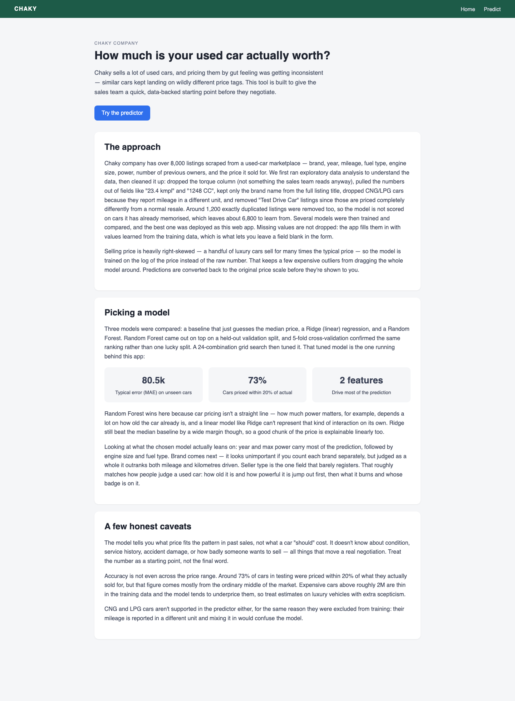
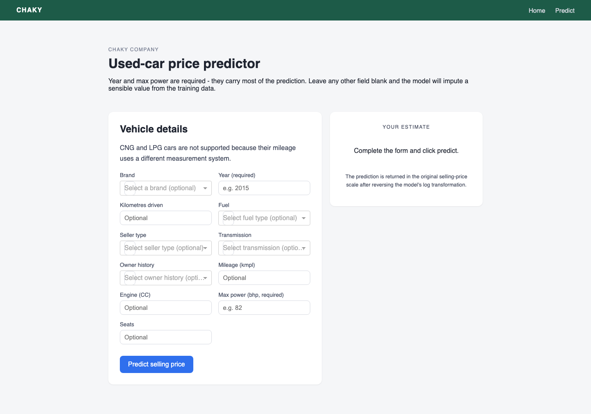

# Car Price Prediction

This project is predicting car selling price for Chaky company.

What's in here:

There are two parts of this project. The first part involves data processing and machine learning model development that's used as the predictor for the second part. The second part is a web app that predicts a car's price based on the specifications input by the user.

1. EDA + preprocessing + model selection (cross-validation, grid search, feature importance) in `notebooks/01_car_price_prediction.ipynb`
2. A small Plotly Dash web app in `app/` that loads the trained pipeline and predicts price

## Screenshots

Landing page, explaining the problem and how the model was chosen:



Prediction form. Year and max power are required, everything else may be left blank and is imputed:



## Results

The dataset is 8,128 used-car listings. Preprocessing removes 1,221 duplicates, the 5 Test Drive
Cars and the CNG/LPG rows, leaving 6,808 cars, and the target is modelled as `log(selling_price)`.

Model comparison, 5-fold cross-validation on train+validation (MAE on the log target, lower is
better):

| Model | CV log MAE | Std |
| --- | --- | --- |
| Random Forest | 0.169 | 0.002 |
| Ridge | 0.200 | 0.004 |
| Baseline (median) | 0.593 | 0.014 |

A 24-combination grid search tuned the Random Forest to 400 trees, `max_depth=20`,
`min_samples_leaf=1`, `max_features='sqrt'` (CV log MAE 0.166). Scored once on the held-out test
set, that model gives:

| Metric | Value |
| --- | --- |
| Log RMSE | 0.223 |
| MAE | 80,491 |
| RMSE | 275,395 |
| R² (price scale) | 0.743 |
| Cars priced within 20% of actual | 72.9% |

`year` and `max_power` dominate the prediction on both built-in and permutation importance, followed
by `engine`, `fuel` and `brand`. R² is computed on the price scale, where a thin tail of luxury cars
carries most of the squared error, so it looks worse than the log-scale metrics the model was
actually fitted on. Section 10 of the notebook discusses this in full.

## Requirements

To run the notebook:

- Python 3.13
- pandas, numpy, matplotlib, seaborn, scikit-learn, jupyter (installed in `.venv`)

To run the Dash app (see `app/requirements.txt`):

- dash>=2.16,<4
- numpy==2.5.2
- pandas==3.0.5
- scikit-learn==1.9.0

To run the app with Docker instead:

- Docker with Docker Compose

## Run the notebook

From the project root, select the project virtual environment as the notebook kernel and open:

```text
notebooks/01_car_price_prediction.ipynb
```

Running it end to end saves the fitted pipeline (imputation + one-hot encoding + grid-searched Random Forest) to:

```text
app/models/car_price_model.pkl
```

## Run the Dash app locally

```bash
./.venv/bin/pip install -r app/requirements.txt
./.venv/bin/python app/code/app.py
```

Open `http://127.0.0.1:8050` in a browser. The app has two pages:

- `/` — landing page explaining the problem, the preprocessing, and why Random Forest was picked
- `/predict` — the actual form. Year and max power are required, since they carry most of the prediction; every other field may be left blank and the saved pipeline imputes it before predicting.

## Run with Docker

```bash
docker compose -f app/docker-compose.yaml up --build
```

The app is then available at `http://127.0.0.1:8050`.

## Tests

```bash
./.venv/bin/pip install -r app/requirements.txt pytest
./.venv/bin/python -m pytest
```

- `tests/test_model.py` — the saved pipeline loads, exposes the categories the dropdowns rely on, and produces finite, sanely-scaled prices (including when the optional fields are blank and the imputer has to fill them in)
- `tests/test_app.py` — the Dash app builds, both pages register, and the predict callback rejects missing required fields before returning a formatted price

## CI/CD

`.github/workflows/ci.yml` runs on every push and pull request:

1. **Unit tests** — installs `app/requirements.txt` plus pytest on Python 3.13 and runs pytest
2. **Docker build and smoke test** — builds `app/.Dockerfile`, starts the container, waits for it to answer, and checks that `/`, `/predict`, and the Dash callback registry all respond
3. **Publish** — on pushes to `main`/`master` the *already tested* image is pushed to Docker Hub as `<user>/car-price-predictor:latest` and `:<sha>`

The image is built by GitHub Actions, not by Docker Hub — Docker Hub's Automated Builds are a paid feature and cannot run the tests before publishing. Docker Hub is only the registry here.

Set these in **Settings → Secrets and variables → Actions** before the first push to `main`:

| Name | Kind | Value |
| --- | --- | --- |
| `DOCKERHUB_USERNAME` | secret | your Docker Hub username |
| `DOCKERHUB_TOKEN` | secret | a Docker Hub access token with Read & Write (Account Settings → Personal access tokens) |
| `DOCKERHUB_REPOSITORY` | variable, optional | `user/repo` if you want a name other than `<user>/car-price-predictor` |

Pull requests build and smoke-test the image but never push it.
